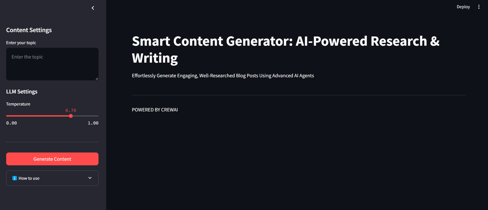

# ContentAI 🤖✨


Let me know if you'd like any more adjustments!
**ContentAI** is an AI-powered research and writing tool designed to help you effortlessly generate engaging, well-researched blog posts on any topic. Powered by GPT-4, ContentAI can fetch up-to-date research, summarize complex information, and write blog posts with statistical data, all while preserving clarity and readability.

---



## Features 🌟
- **AI-Generated Research**: Get a detailed research summary including recent trends, expert opinions, and data-driven insights.
- **Engaging Blog Posts**: Automatically create a structured blog post that highlights key points and data.
- **Customizable Output**: Adjust the temperature and writing style to match your preferences.
- **Content Metrics**: Automatically generate important content metrics such as word count, readability score, and number of sections.
- **Markdown Export**: Easily export your generated content as a markdown file for use on your website or blog.

---

## 📦 Installation

To get started with **ContentAI**, follow the instructions below to set up the project locally.

1. **Clone the repository**:
   ```bash
   git clone https://github.com/arnabsaha7/ContentAI.git
   cd ContentAI
   ```

2. **Install dependencies**:
   ```bash
   pip install -r requirements.txt
   ```

3. **Set up environment variables**:
   Create a `.env` file and add your OpenAI API key:
   ```env
   OPENAI_API_KEY="your_openai_api_key"
   ```

4. **Run the application**:
   ```bash
   streamlit run app.py
   ```

Your content generator should now be running at `http://localhost:8501`!

---

## 🔧 Usage

1. **Enter your topic** in the text box.
2. Adjust the **temperature** slider to control the creativity of the output (lower for formal, higher for creative).
3. Click on **Generate Content** to start the magic.
4. Review the generated **research summary** and **blog post**.
5. Download the content as a **Markdown file** and start publishing!

---

## 📝 Example Output

### Research Summary:

> **Topic**: Artificial Intelligence in Healthcare
>
> Recent developments in healthcare technology have significantly benefited from AI, particularly in diagnostics and treatment recommendations. For example:
>
> - **AI Diagnostics**: AI systems can analyze medical images with **98% accuracy**.
> - **Market Growth**: The AI healthcare market is expected to reach **$45.2 billion by 2026**, growing at a CAGR of **40%**.

### Generated Blog Post:

> **Artificial Intelligence in Healthcare: Transforming Medicine**
>
> In recent years, artificial intelligence has emerged as a game-changer in healthcare. AI-powered systems now assist in diagnostics, treatment plans, and more...
>
> **Key Statistics:**
> - AI-powered diagnostic tools have reached an **accuracy rate of 98%** in certain imaging tasks.
> - The AI healthcare market is predicted to reach a value of **$45.2 billion by 2026**.

---

## 📊 Content Metrics

- **Word Count**: 1,500
- **Readability Score (Flesch Reading Ease)**: 75.6
- **Number of Sections**: 8
- **Number of Data Points**: 5

---

## 🚀 Contributing

We welcome contributions from the community! To contribute, please fork the repository and submit a pull request. Follow the guidelines below:

1. Fork the repository.
2. Create a new branch (`git checkout -b feature-branch`).
3. Commit your changes (`git commit -am 'Add new feature'`).
4. Push to the branch (`git push origin feature-branch`).
5. Create a pull request.

---

## 🧑‍💻 Built With

- [OpenAI GPT-4](https://openai.com/)
- [Streamlit](https://streamlit.io/)
- [Python](https://www.python.org/)
- [Textstat](https://github.com/shivam5992/textstat)
- [dotenv](https://pypi.org/project/python-dotenv/)

---

## 📝 License

This project is licensed under the MIT License - see the [LICENSE](LICENSE) file for details.

---

## 📱 Follow Us

- [Twitter](https://twitter.com/yourusername)
- [LinkedIn](https://linkedin.com/in/yourusername)
- [Website](https://yourwebsite.com)

---


```
